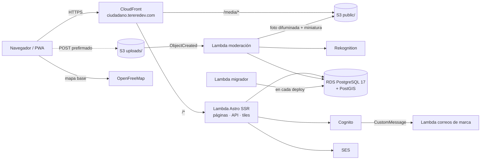
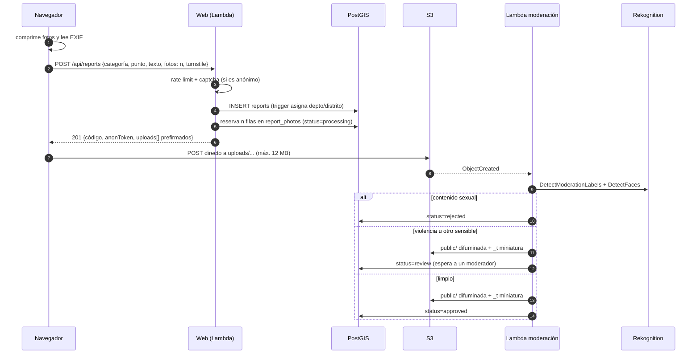
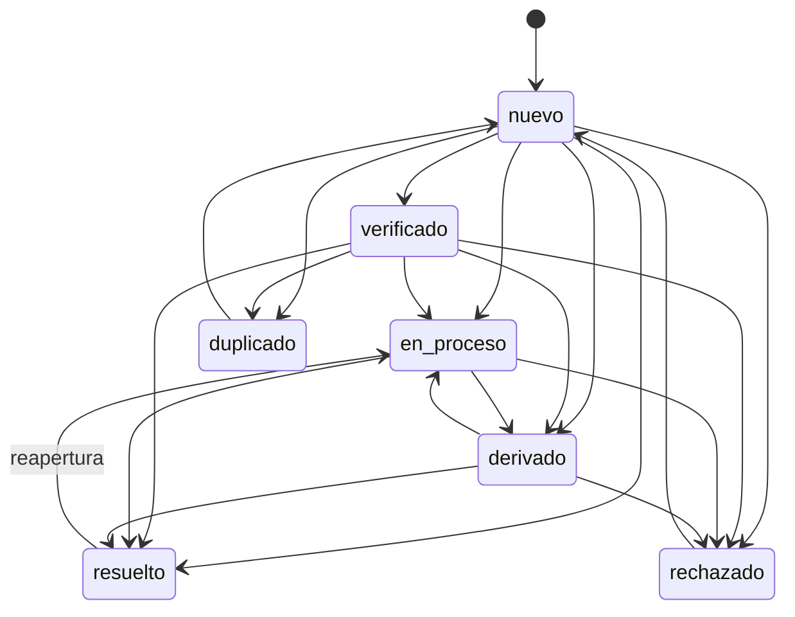
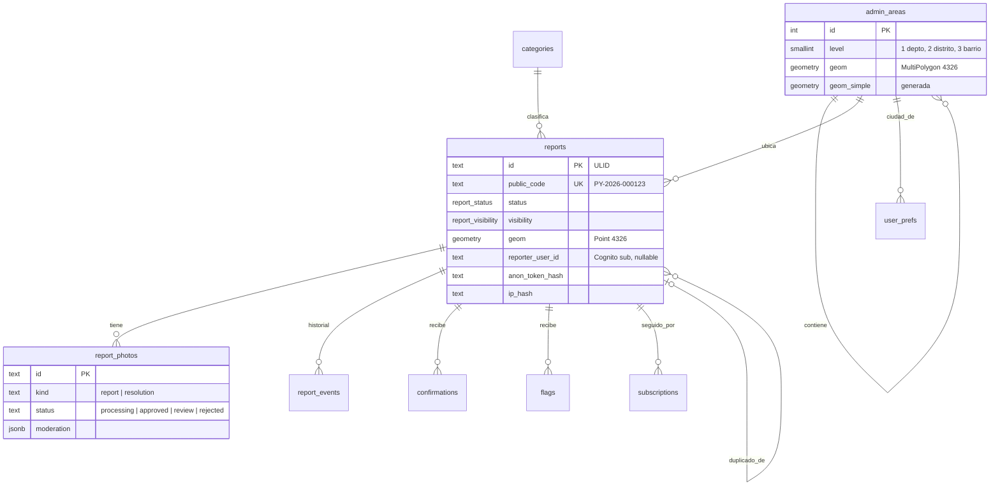

# Arquitectura

Cómo está armado Reporte Ciudadano y por qué. Leelo antes de un cambio que toque más de un paquete o la infraestructura.

## Principios

1. **Costo fijo mínimo.** El proyecto se sostiene sin financiamiento, así que todo lo que puede ser por uso lo es (Lambda, CloudFront, Rekognition) y lo fijo se reduce al mínimo (una RDS chica y un NAT de USD 3). No hay Redis, WAF ni NAT Gateway administrado.
2. **Privacidad por defecto.** Se puede reportar sin cuenta. Las fotos se publican solo después de difuminar caras. Las IP se guardan como hash con sal. Los datos abiertos no incluyen datos personales.
3. **El dominio vive en SQL.** La lógica de reportes y GIS está en `packages/core` como funciones TypeScript que ejecutan SQL de PostGIS. La web y las Lambdas son capas finas que validan entrada y llaman al core.
4. **Pocas piezas.** Una base, un bucket, una app SSR. Nada de colas ni microservicios hasta que haga falta.

## Vista general



Todo corre en `us-east-1`. La web y las Lambdas que tocan la base viven en subredes privadas de la VPC; salen a internet por una instancia NAT ([fck-nat](https://fck-nat.dev)) y llegan a S3 por un gateway endpoint gratuito.

## Paquetes

```
packages/core       @rc/core       dominio, SQL y migraciones (sin dependencias de AWS salvo sst Resource)
packages/functions  @rc/functions  Lambdas que no son la web
packages/web        @rc/web        app Astro: páginas, API, tiles, PWA
infra/                             definición de recursos con SST
```

Las dependencias van en una sola dirección: `web → core` y `functions → core`. **`core` nunca importa de `web` ni de `functions`.**

### `packages/core`

Se exporta por archivo (`@rc/core/reports`, `@rc/core/stats`…), sin barril.

| Módulo | Responsabilidad |
|---|---|
| `db.ts` | Cliente `postgres` único. Usa `DATABASE_URL` en local/tests o el recurso vinculado `Database` en AWS |
| `migrate.ts` | Aplica migraciones con lock de advisory |
| `reports.ts` | Crear, listar, buscar duplicados, confirmar, denunciar, cambiar estado y visibilidad, comentarios, suscripciones |
| `status.ts` | Estados, etiquetas, colores y transiciones permitidas |
| `categories.ts` | Categorías, ventanas de vigencia y campos extra |
| `photos.ts` | Reserva de fotos y cierre tras la moderación |
| `areas.ts`, `seed-areas.ts`, `area-names.ts` | Departamentos y distritos: carga desde geoBoundaries, ubicación de un punto, nombres con tildes |
| `tiles.ts` | Tiles vectoriales MVT (`ST_AsMVT`) con agrupamiento en zoom bajo |
| `stats.ts` | Resumen, conteos por área, serie temporal, puntos críticos (DBSCAN) y exportación GeoJSON/CSV |
| `ratelimit.ts` | Límite por ventana fija guardado en Postgres |
| `users.ts` | Ciudad del usuario para centrar el mapa |

Los errores de negocio se lanzan como `DomainError(code, message, status)`; la web los traduce a respuestas JSON.

### `packages/functions`

| Lambda | Disparador | Qué hace |
|---|---|---|
| `migrator.ts` | Cada deploy (`aws.lambda.Invocation`) | Aplica migraciones y, si la tabla está vacía, carga departamentos y distritos |
| `moderation.ts` | `s3:ObjectCreated` en `uploads/` | Normaliza la imagen, consulta Rekognition, difumina caras, genera miniatura, publica en `public/` |
| `auth-messages.ts` | Trigger `CustomMessage` de Cognito | Reemplaza los correos genéricos por HTML con la marca (`auth-email.ts`) |

`image.ts` contiene la lógica pura (decisión de moderación, difuminado, miniatura) para poder testearla sin AWS.

### `packages/web`

Astro 7 en modo `server` con el adaptador `astro-sst` (parcheado con `pnpm patch` en `patches/` para soportar Astro 6+ hasta que salga la versión oficial). Las páginas se renderizan en el servidor; la interactividad va en **islas React** (`src/components/islands/`): mapa, asistente de reporte, consultas GIS, panel de admin.

```
src/pages/            rutas (Astro y endpoints .ts)
  api/                API JSON
  tiles/[z]/[x]/[y]   tiles MVT
  py/[dept]/[district] páginas por área (SEO)
  r/[slug]            página de un reporte (PY-2026-000123-titulo)
  admin/              panel (requiere grupo admin o moderador)
src/components/islands/  componentes React hidratados en el cliente
src/lib/server/       solo servidor: auth, Cognito, config, servicios AWS, helpers HTTP
src/lib/client/       solo navegador: API, mapa, imágenes, cola offline
src/middleware.ts     sesión y protección CSRF
public/sw.js          service worker
```

`lib/server/config.ts` es el único lugar que lee recursos de SST y variables de entorno; si un recurso no existe (desarrollo local sin AWS) devuelve `undefined` y la funcionalidad se apaga sola.

## Flujos principales

### Crear un reporte con fotos



Puntos clave:

- **La Lambda web nunca toca los bytes de las fotos.** Firma un POST de S3 con límites de tamaño y tipo, y el navegador sube directo.
- **Los originales son privados** y se borran a los 90 días (regla de ciclo de vida). Solo se sirve lo que está en `public/`.
- **La moderación es idempotente**: si la Lambda se reintenta y la foto ya no está en `processing`, no hace nada.
- **Reportes anónimos**: se devuelve un `anonToken` que el navegador guarda; en la base solo queda su SHA-256. Con él se pueden agregar fotos después.
- **Sin conexión**: si no hay red, `lib/client/outbox.ts` guarda el reporte y las fotos en IndexedDB y los envía al reconectar.

### Estados de un reporte



La fuente de verdad es `TRANSITIONS` en `packages/core/src/status.ts`. Cada cambio queda en `report_events` y se avisa por correo a quienes siguen el caso. Pasar a `duplicado` exige indicar el reporte original.

Aparte del estado, cada reporte tiene **visibilidad**: `published`, `pending` o `hidden`. Con 3 denuncias de la comunidad (`FLAGS_TO_HIDE`) pasa sola a `pending` hasta que un moderador decida.

### Autenticación

- Los formularios propios (`/ingresar`, `/registro`, `/recuperar`) llaman a la API de Cognito **desde el servidor** (`USER_PASSWORD_AUTH`); la contraseña nunca va del navegador a Cognito directo.
- Google entra por el Hosted UI con flujo `code` + PKCE y vuelve a `/auth/callback`.
- La sesión son cookies `httpOnly`: `rc_id` (ID token, verificado con `aws-jwt-verify`) y `rc_refresh` para renovarlo.
- Roles: grupos de Cognito `admin` (todo) y `moderador` (estados y moderación).
- **CSRF**: las escrituras a `/api/*` solo aceptan `application/json` y, si llega `Origin`, debe ser el propio sitio. No se habilita CORS para escrituras.

### Mapa y GIS

- **Mapa base**: estilos de OpenFreeMap, sin API key ni costo.
- **Reportes**: tiles MVT generados en Postgres (`/tiles/{z}/{x}/{y}.pbf`). Debajo de zoom 11 se agrupan en una grilla y se envían centroides con conteo; desde zoom 11 van los puntos. CloudFront los cachea porque el middleware no lee la sesión en esas rutas.
- **Áreas**: un trigger en `reports` asigna `dept_id` y `district_id` con `ST_Intersects` al insertar. `admin_areas.geom_simple` es una columna generada con la geometría simplificada para coropléticos rápidos.
- **Consultas GIS** (`/estadisticas`): el usuario dibuja un polígono (terra-draw) y `stats.ts` filtra con `ST_Intersects`. Los puntos críticos usan `ST_ClusterDBSCAN`.
- **Datos abiertos**: `/api/stats/export.geojson` y `.csv`, con CORS abierto para lectura.

## Modelo de datos



Otras tablas: `rate_limits` (contadores por ventana), `schema_migrations`.

Convenciones:

- Coordenadas siempre en **EPSG:4326** (lng, lat). Se transforma a 3857 solo para tiles.
- IDs de reportes y fotos son **ULID** (ordenables por tiempo). El código público sale de una secuencia.
- Los usuarios no tienen tabla propia: se identifican por el `sub` de Cognito.

## Infraestructura

Definida en `sst.config.ts` + `infra/`. Cada archivo de `infra/` exporta una función `createX()`.

| Archivo | Recursos |
|---|---|
| `vpc.ts` | VPC 10.20.0.0/16, 1 subred pública, 2 privadas (RDS exige 2 AZ), instancia fck-nat t4g.nano (también bastión SSM), endpoint de S3 |
| `database.ts` | RDS Postgres 17 t4g.micro 20 GB, backups 7 días, protección contra borrado en producción; Lambda migradora |
| `storage.ts` | Bucket `Media` con `uploads/` (originales, expiran a 90 días), `review/`, `withheld/` (privados) y `public/` (servido) |
| `moderation.ts` | Notificación S3 → Lambda de moderación con permisos de Rekognition |
| `auth.ts` | User pool, cliente, grupos, Google opcional, marca del Hosted UI, trigger de correos |
| `web.ts` | Router de CloudFront, app Astro, SES opcional |
| `secrets.ts` | Secreto de Turnstile, sal para IPs y secreto de CloudFront (vinculados, no en variables de entorno) |
| `budget.ts` | Alerta de AWS Budgets (solo producción, con `ALERT_EMAIL`) |

**Stages**: `production` retiene y protege los recursos (`removal: retain`, `protect: true`). Cualquier otro stage se borra completo con `sst remove`. En `sst dev` no se crea VPC ni RDS: se usa la base local.

## Costos

| Recurso | USD/mes |
|---|---|
| RDS t4g.micro + 20 GB gp2 | ~13,5 |
| fck-nat t4g.nano + IPv4 pública | ~7,3 |
| **Fijo** | **~21** |
| Lambda, CloudFront, S3, Cognito Lite | por uso, centavos con tráfico bajo |
| Rekognition | ≈ 0,002 por foto (2 llamadas) |

Se alerta por correo al 80 % real o 100 % proyectado de USD 30.

## Seguridad

- Base de datos en subred privada, sin acceso público; se entra por SSM a través del NAT.
- **IP del visitante**: la CloudFront Function del router agrega `x-rc-viewer-ip` (de `event.viewer.ip`) y un secreto compartido (`x-rc-edge`). La web solo confía en esa IP si el secreto coincide; nunca usa `X-Forwarded-For`. Lo que llega directo a la URL de la Lambda cuenta como `0.0.0.0` y comparte un solo cupo.
- Rate limiting en Postgres por usuario o hash de IP (8 reportes/hora anónimo, 20 con cuenta).
- **Denuncias**: una por cuenta o por IP. Un reporte pasa a revisión solo con 3 denuncias sin resolver y al menos una de alguien con cuenta; al moderarlo, las denuncias se resuelven.
- **Fotos**: solo `public/` es legible por CloudFront, y solo desde distribuciones de esta cuenta (`aws:SourceAccount`). Las que piden revisión humana van a `review/` (el staff las ve por `/api/admin/photos/{id}/image`); ocultar un reporte mueve sus fotos a `withheld/` e invalida CloudFront. Las Lambdas tienen permisos por prefijo, no `s3:*`.
- **Sesión**: cerrar sesión es un POST que revoca el refresh token en Cognito y envía `Clear-Site-Data: "cache"`. El service worker solo guarda versiones de páginas pedidas sin cookies y nunca respuestas `private`/`no-store`. Una respuesta que fija cookies nunca se cachea en CloudFront.
- **HTML**: nada de `set:html` con datos de usuarios; el JSON-LD se serializa con `safeJson` (escapa `<`, `>` y `&`).
- **Exportación CSV**: los textos que empiezan con `= + - @` se neutralizan para que Excel no los ejecute como fórmulas.
- Captcha Cloudflare Turnstile para reportes anónimos (opcional, se activa con el secreto).
- Moderación automática de imágenes + revisión humana para casos dudosos.
- Validación de entrada con Zod en todos los endpoints.
- Coordenadas fuera de Paraguay se rechazan (`COUNTRY_BBOX`).

## Decisiones y alternativas descartadas

| Decisión | Alternativa | Por qué |
|---|---|---|
| fck-nat en una instancia | NAT Gateway | USD 3 vs USD 32+/mes; aceptamos un punto único de falla en la salida a internet |
| Rate limit en Postgres | Redis / WAF | Sin costo fijo adicional; el volumen no lo justifica |
| Tiles MVT desde PostGIS | Tiles pregenerados / servicio externo | Siempre actualizados, cacheados por CloudFront |
| Astro SSR + islas | SPA | HTML indexable para SEO por área y por reporte, poco JS en páginas de lectura |
| SQL directo con `postgres` | ORM | Las consultas GIS son la parte central y se expresan mejor en SQL |
| Cognito Lite | Auth propia | Sin costo hasta 10.000 usuarios activos y sin guardar contraseñas |

## Para extender

- **Nueva categoría**: desde `/admin/categorias` (no requiere deploy). Para categorías por defecto, una migración nueva.
- **Nuevo país**: ampliar `COUNTRY_BBOX`, `seed-areas.ts` (`COUNTRY`) y el prefijo del código público.
- **Barrios (nivel 3)**: el esquema ya lo soporta (`level 3`, `barrio_id`); falta una fuente de datos y la carga.
